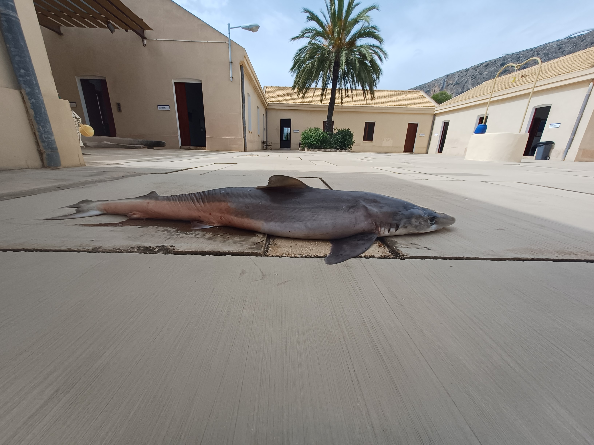
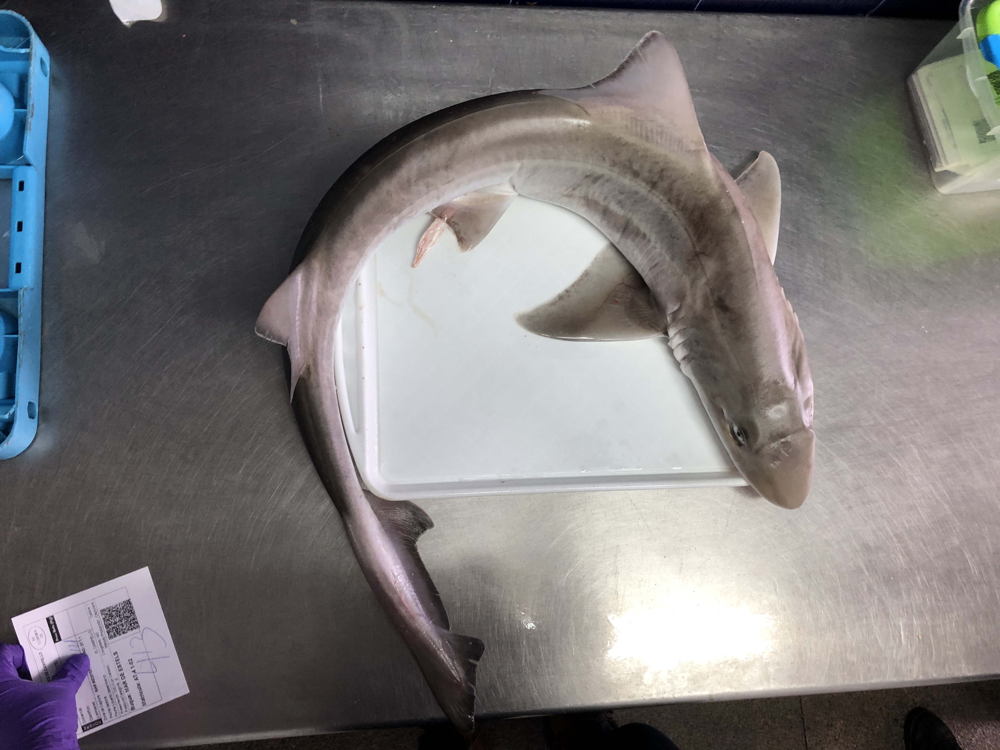

# 🦈 eLasmobranc Dataset – Sharks & Rays (v1.0)

<p>
  <a href="https://zenodo.org/records/18549737">
    
  </a>
</p>

## 👀 Overview

The **eLasmobranc Dataset** is an image collection designed to support computer vision research and scientific analysis focused on the identification of elasmobranch species (sharks and rays).

The dataset was developed within the framework of the e-Lasmobranc project at the University of Alicante and is conceived as an open, continuously evolving resource. It integrates images from public Creative Commons sources with original material collected through collaborations and fieldwork.

**Version 1.0** includes **1,117 images** corresponding to **807 distinct individuals**, belonging to **seven target elasmobranch species**:
- *Galeorhinus galeus*
- *Galeus melastomus*
- *Leucoraja naevus*
- *Mustelus mustelus*
- *Oxynotus centrina*
- *Scyliorhinus canicula*
- *Torpedo marmorata*

Most images were captured out of water to minimize visual distortions and ensure clear visibility of morphological traits. All samples were filtered using basic quality criteria and subsequently **validated by experts** to guarantee correct species identification and sufficient morphological information.

For each image, standardized metadata are provided, including:
- **Observation date (DD-MM-YYYY)**
- **Country and area of origin**
- **Original source and license**

The dataset is intended for tasks such as species classification, zero-shot and few-shot learning, morphology-driven recognition and the study of marine biodiversity.

## 🎯 Key Features
- First open dataset specifically dedicated to elasmobranch species identification.
- Expert-validated images with visible diagnostic morphological traits.
- Standardized temporal and geographic metadata.
- Includes external knowledge resources (taxonomic keys) to support morphology-aware approaches.
- Designed for both marine science studies and computer vision research.

## 🗂️ Dataset Structure
```
.
├── data/
│   ├── galeorhinus_galeus/
│   │   ├── GG_001_01.jpg
│   │   ├── ...
│   │   └── GG_metadata.csv
│   ├── galeus_melastomus/
│   ├── leucoraja_naevus/
│   ├── mustelus_mustelus/
│   ├── oxynotus_centrina/
│   ├── scyliorhinus_canicula/
│   └── torpedo_marmorata/
│
├── Elasmobranch taxonomic keys.xlsx   # Morphological traits per species
├── attributions.csv                  # Image sources, licenses and attribution text
└── citations.txt                    # Citation references for all data sources

```

Each species folder contains:
- Images identified by a unique ID encoding species–individual–image (e.g., GG_001_01)
- A species-specific CSV file with metadata for each imag

<details>
<summary><strong>📸 View image samples</strong></summary>
<p align="center">
  
  
</p>
<p align="center">
  
  
  

</details>

## 🔎 Dataset Summary

**Total images**: 1,117
**Distinct individuals**: 807
**Species**: 7
**Sources**:
- External (public datasets and web platforms): ~80%
- Internal (fieldwork and collaborations): ~20%

The following table summarizes the number of images per species in the eLasmobranc Dataset:  

| Elasmobranch Species | Number of Images |
|---------------------|------------------|
| *Galeorhinus galeus*      | 79 |
| *Galeus melastomus*      | 31 |
| *Leucoraja naevus*       | 103 |
| *Mustelus mustelus*     | 198 |
| *Oxynotus centrina*     | 32 |
| *Scyliorhinus canicula* | 575 |
| *Torpedo marmorata*     | 99 |

## 🔗 How to cite

If you use the eLasmobranc Dataset in your research, please cite it as follows:

*Beviá-Ballesteros, I., Jerez-Tallón, M., Aranda-Garrido, N., Abel-Abellán, I., Antón-Linares, I., Azorín-López, J., Saval-Calvo, M., Fuster-Guilló, A., and Giménez-Casalduero, F. (2026). eLasmobranc Dataset: An Image Dataset for Elasmobranch Species Recognition and Biodiversity Monitoring. arXiv preprint arXiv:2603.10724*

## 📝 License

The eLasmobranc Dataset is distributed under a CC-BY-NC license. Images from external sources additionally preserve their original Creative Commons licenses, all of which are explicitly documented in attributions.csv.

Copyright (C) 2026. e-Lasmobranc project: New technologies and advances in the knowledge of elasmobranchs from the Spanish east, University of Alicante 

## 📬 Contact

| Name | Role | Contact | Department |
|------|------|---------|-----------|
| Ismael Beviá Ballesteros | Data manager | ismael.bevias@ua.es | Computer Technology |
| Nieves Aranda Garrido | Data collector | – | Marine Research Center |
| Mario Jerez Tallón | Researcher | – | Marine Research Center |
| Isabel Abel Abellan | Data curator | – | Marine Research Center |
| Irene Antón Linares | Researcher | – | Marine Research Center |
| Marcelo Saval Calvo | Supervisor | – | Computer Technology |
| Jorge Azorín López | Supervisor | - | Computer Technology |
| Andrés Fuster Guilló | Project leader | fuster@ua.es | Computer Technology |
| Francisca Giménez-Casalduero | Project leader | – | Marine Research Center |

## 🤝 Acknowledgments

This research was funded by the eLasmobranc project, which is developed with the collaboration of the Biodiversity Foundation of the Ministry for Ecological Transition and the Demographic Challenge, through the Pleamar Programme, and is co-financed by the European Union through the European Maritime, Fisheries and Aquaculture Fund.


